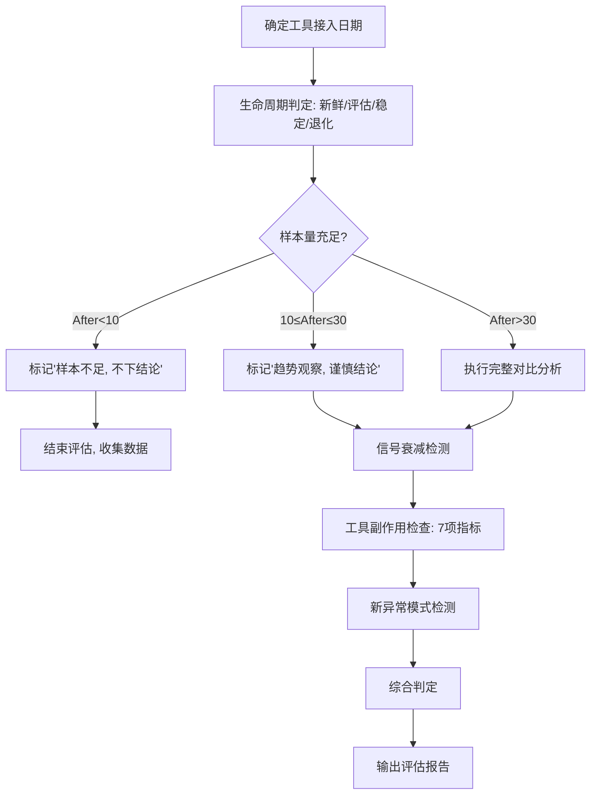

# A5 工具评估执行指南
> 用于每天 23:00 cron `A5-每日复盘`（复盘后的第二步）
> 路径: `profiles/a5-review/output/工具评估_YYYY-MM-DD.md`

---

## 第一步：确定评估目标

读 `TOOL_LOG.md` 找到当前需要评估的工具列表：

```bash
cd ~/zq_web4_trading_system
cat tools/TOOL_LOG.md 2>/dev/null || echo "⚠️  TOOL_LOG.md 不存在，使用 --auto-detect"
```

每个工具接入时记录了**它解决什么问题**和**预期改善什么指标**。先确认：
- 这个工具的名字
- 接入日期（YYYY-MM-DD）
- 预期改善指标（胜率？信号正确率？平均P&L？）

---

## 🔷 专业升级：工具生命周期管理（第一步：确定评估目标时同步判断）

### 四个生命周期阶段

每个工具接入后，必须根据接入时间确定其生命周期阶段，不同阶段的评估规则不同：

| 阶段 | 时间窗口 | 评估规则 | 能否下结论 |
|:-----|:---------|:---------|:----------|
| 🆕 **新鲜期** | 接入后 0-7 天 | 仅观察，不下结论 | ❌ 不能 |
| 🔍 **评估期** | 接入后 7-30 天 | 初步评估，标记趋势 | ⚠️ 谨慎结论 |
| ✅ **稳定期** | 接入后 30+ 天 | 可以下结论 | ✅ 可以 |
| ⚠️ **退化期** | 信号衰减迹象出现 | 检测到持续下降趋势时进入 | ⚠️ 需重新评估 |

### 生命周期阶段判定规则

**新鲜期判定**（0-7天）：
- 工具刚接入，数据积累不足
- 可能受"新鲜效应"影响（短期效果好但不持续）
- 任何结论都不应该下，只做数据采集
- After样本 < 5笔时，强制视为新鲜期

**评估期判定**（7-30天）：
- 有初步数据积累，但样本量可能不足
- 可以标记趋势方向，但不能下确定性结论
- 输出中使用 `👀 趋势观察:` 而不是 `✅ 结论:`
- 评估期内的结论必须附带 `[置信度: low]` 标签

**稳定期判定**（30+天）：
- 有足够的样本积累
- 可以下确定性结论
- 输出中使用 `✅ 结论:` 标记

**退化期判定**（信号衰减检测）：
- 详见第三步中的信号衰减检测方法
- 进入退化期后，评估结论自动降级为 `⚠️ 需关注: 信号衰减迹象`

### 生命周期标记规范

在工具评估报告的每个工具章节头部，加入生命周期标记：

```markdown
## 🛠️ TOOL_EVAL — 工具名
**生命周期阶段:** 🆕新鲜期 / 🔍评估期 / ✅稳定期 / ⚠️退化期
**接入天数:** N 天
**样本量:** After N 笔 (有效样本 N 笔)
**结论可信度:** 低 / 中 / 高
```

---

## 第二步：运行评估命令

### 方案A：有TOOL_LOG.md → 自动检测

```bash
cd ~/zq_web4_trading_system && python3 tools/tool_eval.py --auto-detect --days 7 > profiles/a5-review/output/工具评估_$(date +%F).md
```

### 方案B：已知工具名+接入日期 → 指定评估

```bash
cd ~/zq_web4_trading_system && python3 tools/tool_eval.py --tool "工具名=YYYY-MM-DD" --days 14 > profiles/a5-review/output/工具评估_$(date +%F).md
```

**参数说明：**
- `--auto-detect` → 自动扫描 `TOOL_LOG.md` 中所有已安装工具
- `--tool "name=YYYY-MM-DD"` → 指定单个工具（可多次使用，评估多个工具）
- `--days 7` → Before/After各取N天数据（默认14天）
  - Before: 接入日期往前N天
  - After: 接入日期往后N天（含当天）
- 输出到标准输出，重定向到文件

**检查输出：**
```bash
cat profiles/a5-review/output/工具评估_$(date +%F).md
```
确认有对比表格和结论。

---

## 第三步：工具评估判断树

### 核心逻辑

```
读TOOL_LOG.md获取工具接入日期
       ↓
截取Before窗口（接入前N天）和After窗口（接入后到当天）
       ↓
对比6项关键指标
       ↓
     ┌──┬──┬──┐
   有效 需要更  效果
   改善 多数据  负面
     │    │    │
   符合  样本  指标全面
   标准  不足  恶化
```

### 6项关键指标解读

| 指标 | 代码字段 | 什么算好 | 什么算差 |
|:-----|:---------|:---------|:---------|
| 胜率 | `win_rate` (P&L>0占比) | 提升 | 下降 |
| 平均P&L% | `avg_pl_pct` | 提升 | 下降 |
| 正确退出% | `correct_exit%` | 提升 | 下降 |
| 错误退出% | `wrong_exit%` | 下降 | 提升 |
| 中性退出% | `neutral_exit%` | 下降（中性少=信号明确） | 提升 |
| 总P&L (USD) | `total_pl_usd` | 亏损减少/盈利增加 | 亏损增加/盈利减少 |

### E系列信号质量对比（额外层）

每个信号的 `before 正确率 vs after 正确率`：

| 信号 | 解读 |
|:----|:-----|
| E1 | 趋势确认信号 — 正确率应最高 |
| E2 | 短期波动信号 — 正确率通常低 |
| E3 | 噪声过滤器 — 正确率低是常态 |
| E4 | 风控信号 — 正确率≥50%算合格 |
| E5 | 止损触发 — 正确率100%正常 |

### 三个结论判定标准

**✅ 有效改善** — 同时满足：
- 胜率提升 > 5个百分点
- After样本数 > 30笔
- 正确退出率提升 > 5个百分点 或 错误退出率下降 > 5个百分点
- 无任何关键指标全面恶化

**👀 需要更多数据** — 满足任一：
- After样本数 < 10笔
- 胜率变化在 ±5% 以内（随机波动范围）
- 趋势方向模糊

**❌ 效果负面** — 满足任一：
- 胜率下降 > 5个百分点
- 错误退出率上升 > 10个百分点
- 总P&L从盈利变大幅亏损
- 3项以上指标同时恶化

---

## 🔷 专业升级一：信号衰减检测（Signal Decay Detection）

### 核心原理

> 策略/工具的早期表现往往比后期好。如果效果持续下降 → 工具价值在衰减。

工具在刚接入时效果最好（新鲜效应），因为开发时用了历史数据做优化。真实交易中效果会随时间回归均值。

### 检测方法：After期三段对比法

将After期均分为**前段/中段/后段**，对比各段的关键指标：

```bash
# 伪代码逻辑
after_window = after_end_date - after_start_date  # After总天数
segment_size = after_window // 3  # 每段天数

前段 = after_start_date 至 after_start_date + segment_size
中段 = 前段结束日 至 前段结束日 + segment_size
后段 = 中段结束日 至 after_end_date

对比三段各项指标的变化趋势
```

### 信号衰减判定规则

| 三段趋势 | 判定 | 行动 |
|:---------|:-----|:-----|
| 📈 前<中<后 （逐段上升） | 效果在增强 | ✅ 工具价值上升 |
| ➖ 前≈中≈后 （平稳） | 效果稳定 | ✅ 工具有持续价值 |
| 📉 前>中>后 （逐段下降） | **信号衰减** | ⚠️ 工具价值在下降 |
| 📊 前>中<后或前<中>后 （波动） | 波动不稳定 | 🔍 需要更多数据 |
| 📉 前≈中>后 （后期骤降） | **后期衰减** | ⚠️ 可能已过最佳期 |

### 衰减报告格式

```markdown
### 📉 信号衰减检测 — 工具名
| 分段 | 时间段 | 胜率 | 平均P&L% | 正确退出% | 样本数 |
|:----|:-------|:---:|:--------:|:---------:|:-----:|
| 前段 | MM-DD~MM-DD | X% | X.X% | X% | N |
| 中段 | MM-DD~MM-DD | X% | X.X% | X% | N |
| 后段 | MM-DD~MM-DD | X% | X.X% | X% | N |
| **趋势** | | **📈/➖/📉** | **📈/➖/📉** | **📈/➖/📉** | |

**判定:** ✅效果增强 / ✅效果稳定 / ⚠️信号衰减 / 🔍波动异常
```

### 信号衰减后的行动

- 轻度衰减（下降<10%）→ 降级为"观察中"，继续收集数据
- 中度衰减（下降10-20%）→ 建议寻找替代工具
- 严重衰减（下降>20%）→ 强烈建议替换

---

## 🔷 专业升级二：统计显著性判断

### 样本量门槛规则

| After样本量 | 可下什么结论 | 示例说法 |
|:-----------|:------------|:---------|
| After < 10 笔 | ❌ 不结论 | "样本不足(n=5)，无法下结论" |
| After 10-30 笔 | ⚠️ 观察趋势，不下定论 | "可以观察趋势(n=18)，但波动大，不排除随机性" |
| After > 30 笔 | ✅ 可以下结论 | "样本充足(n=42)，有效/无效的判断可信" |

### 用中位数取代平均数（避免极端值扭曲）

P&L分布通常不符合正态分布——少数极端值（比如-100%的数据污染、+50%的暴利单）会严重扭曲平均数。

**检查方法：**
```bash
# 在工具评估的输出中，每条Before/After数据都加上中位数对比

## 原模板（只有平均数）：
| 平均P&L% | X.X% | X.X% | ±X.X% | 📈📉➖ |

## 升级后（平均数+中位数）：
| 平均P&L% | X.X% (中位数: X.X%) | X.X% (中位数: X.X%) | ±X.X% | 📈📉➖ |
```

**判断规则：**
- 如果 平均数 - 中位数 > 平均数 × 20% → 存在极端值扭曲，以中位数为主
- 如果 平均数 ≈ 中位数 → 分布均匀，直接用平均数
- 在结论中注明：`📊 分布异常，以中位数为准` 或 `📊 分布正常，使用平均数`

### 置信区间粗略判断

无需复杂统计计算，使用简化版：

- After样本10-30笔：指标变化需 > 10个百分点才有参考价值
- After样本30-50笔：指标变化需 > 5个百分点才有参考价值
- After样本>50笔：指标变化需 > 3个百分点才有参考价值

---

## 🔷 专业升级三：工具副作用检查

### 核心原则

> 工具改善指标A的同时可能损害指标B。必须全面检查，不能只看单一指标。

### 必查的7项指标对照表

每次工具评估，除了查看预期改善的指标外，必须逐项检查所有相关指标是否有副作用：

| 指标 | 预期方向 | 实际方向 | 副作用判定 |
|:-----|:--------:|:--------:|:----------|
| 胜率 | ↑ | ↑/↓ | 预期改善 / 副作用 |
| 平均P&L% | ↑ | ↑/↓ | 预期改善 / 副作用 |
| 正确退出% | ↑ | ↑/↓ | 预期改善 / 副作用 |
| 错误退出% | ↓ | ↑/↓ | 预期改善（↓）/ 副作用（↑） |
| 中性退出% | ↓ | ↑/↓ | 预期改善（↓）/ 副作用（↑） |
| 总P&L (USD) | ↑ | ↑/↓ | 预期改善 / 副作用 |
| 交易频率 | — | ↑/↓ | 副作用（过高→手续费多/过低→机会成本） |

### 副作用严重程度

| 副作用表现 | 程度 | 行动 |
|:-----------|:----|:-----|
| 无副作用或影响<5% | ✅ 无 | 正常使用 |
| 1-2项指标退化，幅度5-10% | ⚠️ 轻度 | 需关注，可继续观察 |
| 3项以上指标退化，幅度10-20% | 🔴 中度 | 建议评估是否值得继续 |
| 关键指标（总P&L）退化 >20% | 🚫 重度 | 强烈建议替换 |

### 额外检查：新异常模式检测

工具接入后，必须检查是否有**新的异常模式出现**：

```markdown
## 工具副作用 — 新异常模式检测

### DQW异常检查
- Before期间: DQW标记 N 笔（异常率 X%）
- After期间: DQW标记 N 笔（异常率 X%）
- 判定: ✅没有增加 / ⚠️异常率上升

### 新出现的问题模式
1. [如果新的异常模式出现，描述它]
   - 首次出现日期: YYYY-MM-DD
   - 出现频率: N 次 / After总交易数
   - 可能关联: [与该工具的关联分析]
```

---

## 🔷 专业升级四：综合应用 — 工具评估完整流程

### 三步融合：生命周期 + 统计显著性 + 信号衰减 + 副作用



### 综合判定矩阵

| 生命周期 | 样本充足 | 信号检测 | 副作用 | 综合结论 |
|:---------|:--------:|:--------:|:------:|:---------|
| 🆕新鲜期 | — | — | — | ❌不下结论，仅观察 |
| 🔍评估期 | 是 | 稳定 | 无 | 👀趋势观察，继续收集 |
| 🔍评估期 | 是 | 衰减 | 无 | 👀关注衰减，延长评估期 |
| ✅稳定期 | 是 | 稳定 | 无 | ✅有效改善，建议继续使用 |
| ✅稳定期 | 是 | 衰减 | 无 | ⚠️进入退化期，关注替代方案 |
| ✅稳定期 | 是 | 稳定 | 有轻度副作用 | ⚠️有效但需监控副作用 |
| ✅稳定期 | 是 | 衰减 | 有中度以上副作用 | ❌建议替换 |

---

## 第四步：输出模板（直接填空）

```markdown
# 📊 ZQ 工具效果评估报告

**报告时间:** YYYY-MM-DD HH:MM
**比较窗口:** N 天 before/after
**交易样本总数:** N

---

## 🛠️ TOOL_EVAL — 工具名

### 📊 工具名
**引入日期:** YYYY-MM-DD
**Before:** N trades
**After:** N trades

| 指标 | Before | After | Δ (变化) | 方向 |
|------|--------|-------|----------|------|
| 总交易数 | N | N | ±N | — |
| 胜率 (P&L>0) | X.X% | X.X% | ±X.X% | 📈📉➖ |
| 平均P&L% | X.X% | X.X% | ±X.X% | 📈📉➖ |
| 正确退出% | X.X% | X.X% | ±X.X% | 📈📉➖ |
| 错误退出% | X.X% | X.X% | ±X.X% | 📈📉➖ |
| 中性退出% | X.X% | X.X% | ±X.X% | 📈📉➖ |
| 总P&L (USD) | $X | $X | ±$X | 📈📉➖ |

#### 📡 E系列信号质量对比

| 信号 | Before 正确率 | Before 次数 | After 正确率 | After 次数 | Δ |
|------|:------------:|:-----------:|:------------:|:---------:|:---:|
| `E1` | X.X% (n=N) | X.X% (n=N) | ±X.X% 📈📉➖ |
| `E2` | X.X% (n=N) | X.X% (n=N) | ±X.X% 📈📉➖ |
| `E3` | X.X% (n=N) | X.X% (n=N) | ±X.X% 📈📉➖ |
| `E4` | X.X% (n=N) | X.X% (n=N) | ±X.X% 📈📉➖ |
| `E5` | X.X% (n=N) | X.X% (n=N) | ±X.X% 📈📉➖ |

### ✅ 结论: 工具名

**生命周期阶段:** 🆕新鲜期 / 🔍评估期 / ✅稳定期 / ⚠️退化期
**接入天数:** N 天 | **样本充足度:** ✅充足(n=N) / ⚠️不足(n=N)

**📈 改善项:**
  - ✅ 指标1 Before→After (+Δ)
  - ✅ 指标2 Before→After (+Δ)

**📉 退步项:**
  - ⚠️ 指标1 Before→After (-Δ)
  - ⚠️ 指标2 Before→After (-Δ)

**📉 信号衰减检测:**
  - 前段: X% → 中段: X% → 后段: X%
  - 判定: ✅稳定 / ⚠️衰减 / 🔍异常波动

**⚠️ 副作用检查:**
  - 7项指标检查: ✅无副作用 / ⚠️轻度(N项) / 🔴中度(N项) / 🚫重度
  - 新异常模式: ✅无 / ⚠️有（详见报告）

**⚠️ 总体: 有效改善 / 需要更多数据 / 效果负面 / 已退化**
  → 一句话建议（继续用/再观察/替换）

---

> *报告由 tool_eval.py 自动生成 | 数据源: data/experience/trades/*.json*
```

---

## 第五步：多工具批量处理（当有多个工具时）

如果TOOL_LOG.md中有多个工具，对每个工具重复第三步+第四步。

```bash
# 一次评估所有工具
cd ~/zq_web4_trading_system && python3 tools/tool_eval.py --auto-detect --days 7 > profiles/a5-review/output/工具评估_$(date +%F).md
```

在输出的报告中，每个工具有自己的 `## 🛠️ TOOL_EVAL — 工具名` 章节。

---

## 常见错误（不要犯）

| # | 错误 | 正确做法 |
|---|------|---------|
| 1 | After样本太少(<5笔)就下结论 | After < 10笔 → 标记"需要更多数据"，不强行结论 |
| 2 | Before和After时间段重叠 | Before和After必须严格以接入日期为界，不能重叠 |
| 3 | 特殊事件/数据污染没排除 | 如果After期间有整批DQW标记的数据污染 → 从样本中排除 |
| 4 | 只比胜率不看其他指标 | 6项指标全部看，不能只看1-2个 |
| 5 | 看不懂为什么平均P&L巨变 | 检查是否有极端值（如-100%卖在0价）扭曲了均值 |
| 6 | 把指标波动当作趋势 | 样本<30笔时，±5%的波动可能是随机噪声 |
| 7 | 不检查E系列信号 | 工具改善往往体现在特定信号上，不能只看总体指标 |
| 8 | 结论写得太绝对 | 写"建议继续观察"比"肯定有效"更安全 |
| 9 | 忘记更新输出日期 | 输出文件名必须是当天日期 |
| 10 | 多个工具混在一起评估 | 每个工具独立评估，不能合并统计 |
| 11 | 忽略生命周期直接下结论 | 新鲜期(0-7天)不能下结论，评估期(7-30天)只能标记趋势 |
| 12 | 不检测信号衰减 | After期要分前中后三段对比，不能只看整体平均数 |
| 13 | 只看平均数不看中位数 | 极端值会扭曲平均数，必须同时看中位数确认分布 |
| 14 | 只看正面指标不看副作用 | 工具改善指标A的同时可能损害指标B，必须全面检查7项 |
| 15 | 不查新异常模式 | 工具接入后可能引入新的DQW异常，必须对比Before/After的异常率 |
