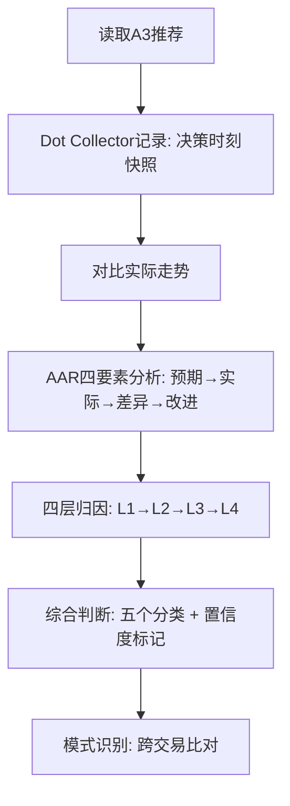

# A5 监督评估执行指南
> 用于每天 08:30 cron `A5-监督评估`
> 路径: `profiles/a5-review/output/监督_YYYY-MM-DD.md`

---

## 第一步：采集数据源

```bash
cd ~/zq_web4_trading_system
```

检查以下四个数据源是否可用：

| # | 数据源 | 路径 | 确认方式 |
|---|--------|------|---------|
| 1 | A3推荐记录 | `profiles/a3-bull/output/` | `ls -lt profiles/a3-bull/output/ \| head -5` |
| 2 | A3 findings | `agents/a3/findings.md` | 确认文件存在 |
| 3 | A4执行记录 | `audit/TRADES.md` | 确认有近7天记录 |
| 4 | 交易经验 | `data/experience/trades/*.json` | `ls data/experience/trades/ \| wc -l` |

如果任一数据源缺失 → 先跑 `--batch` 补全分析，再执行监督。

---

## 第二步：运行评估命令

```bash
cd ~/zq_web4_trading_system && python3 tools/supervision_eval.py --days 7 > profiles/a5-review/output/监督_$(date +%F).md
```

**参数说明：**
- `--days 7` → 评估最近7天的推荐（默认）
- 无需其他参数，工具会自动读取上面4个数据源

**检查输出：**
```bash
cat profiles/a5-review/output/监督_$(date +%F).md | head -5
```
确认文件生成成功，非空。

---

## 第三步：A3推荐质量判断树

### 判断流程

```
读取A3精选报告的推理段落
       ↓
对比该推荐币种在推荐后24h的实际价格走势
       ↓
判断核心逻辑是否成立
       ↓
     ┌──┬──┐
     是  否
     │    │
  逻辑成立  逻辑不成立
     │    │
   ┌─┴─┐  ┌─┴─┐
  方向对 方向错  赚了  亏了
   │    │    │    │
  good  good  lucky poor
  _     _but_      _
  decision unlucky
```

### 五个分类标准（必须严格执行）

| 分类 | 条件1: 逻辑成立? | 条件2: 盈亏方向? | 代码标记 | 示例 |
|------|:-:|:-:|:--------:|------|
| ✅ **good_decision** | ✅ 是 | ✅ 赚 | `thorough` + 盈利 | A3说AI赛道资金流入+AIUSDT趋势健康 → AIUSDT涨了 → 推荐逻辑成立 |
| 🟡 **good_but_unlucky** | ✅ 是 | ❌ 亏 | `thorough` + 亏损 | A3说DOGE放量突破 → 行情意外反转(大盘暴跌) → 逻辑对但亏了 |
| ⚠️ **lucky** | ❌ 否 | ✅ 赚 | `poor` + 盈利 | A3说LAYER因为X理由涨 → X不成立但LAYER莫名其妙涨了 |
| ❌ **poor_decision** | ❌ 否 | ❌ 亏 | `poor` + 亏损 | A3说CRV因为Y理由涨 → Y不成立且CRV跌了 |
| ❓ **inconclusive** | 数据不足无法判断 | — | `inconclusive` | 推荐了但A4未执行/数据中断/价格缺失 |

**特殊处理：**
- **空仓决定**（A3输出SKIP）：单独判断，如果空仓有充分理由（如全币种下跌+F&G恐惧）→ `valid` 好决策；如果空仓是因为A2数据中断而非A3判断 → 标记 `inconclusive` 并备注
- **未执行推荐**（A4没买）：标记 `⏭️ 未执行`，不归类到上面5类，但需要记录原因（价格偏离阈值？其他？）

### 真实案例映射（从系统数据中取）

**good_decision 示例**：2026-05-16 A3输出空仓(SKIP)，F&G恐惧日不强行入场 → 逻辑成立(A3守纪律) → valid
**poor_decision 示例**：2026-05-11 A3推荐LAYER → 推理薄弱(无明显数据支撑)且LAYER亏损-2.5% → poor_decision
**inconclusive 示例**：2026-05-13 空仓但无法识别推荐的币种（数据问题）→ inconclusive
**未执行示例**：2026-05-14 DOGEUSDT推荐，A3推理充分但A4未执行 → ⏭️ 未执行

---

## 🔷 专业升级：AAR框架嵌入（第三步：A3推荐质量判断）

### AAR四要素：每个评估必须回答

AAR（After Action Review）是美国陆军开发的复盘方法论，核心是四步追问。A5的每个监督判断必须包含这四个要素：

```
① 预期（Intent）
   ↓
② 实际（Actual）
   ↓
③ 差异分析（Difference Analysis）
   ↓
④ 改进（Improvement）
```

### 在A3推荐质量判断中的应用

每笔推荐评估的输出必须展开为AAR四段式：

**要素1: 预期 — A3推荐时的逻辑**
- A3推荐这个币种时，预期会发生什么？
- 引用A3的推理原文（必须）
- 写出预期方向（涨/跌/震荡）和预期幅度

**要素2: 实际 — 后来发生了什么**
- 推荐后24h实际价格走势（涨/跌/震荡，幅度）
- A4实际执行结果（如果执行了）：入场价、当前盈亏
- 市场环境变化（大盘走势、板块轮动、黑天鹅事件）

**要素3: 差异分析 — 为什么预期和实际不同**
- 逻辑本身错了？(A3的推理链条有缺陷)
- 逻辑对但意外事件干扰？(黑天鹅/大盘突变)
- 逻辑对但执行偏差？(A4入场时机不好)
- 逻辑对但时间维度不对？(还没到预期时间窗口)

**要素4: 改进 — 下次同样情况怎么做**
- A3方面：推理需要补充什么数据/维度
- A4方面：执行需要什么调整
- 系统方面：需要加什么规则/工具来避免同类问题

### AAR四要素在五个分类中的展开示例

| 分类 | 预期部分 | 实际部分 | 差异分析 | 改进方向 |
|:-----|:---------|:---------|:---------|:---------|
| ✅ good_decision | 预期逻辑成立 | 方向符合预期 | 逻辑与结果一致 | 继续保持 |
| 🟡 good_but_unlucky | 预期逻辑成立 | 方向不符合预期 | 意外事件干扰 | 增加黑天鹅防御 |
| ⚠️ lucky | 预期逻辑不成立 | 方向符合预期 | 运气成分，非逻辑驱动 | 修正推荐逻辑 |
| ❌ poor_decision | 预期逻辑不成立 | 方向不符合预期 | 逻辑错误+结果差 | 重构推理框架 |
| ❓ inconclusive | 预期可判断 | 数据不足以验证 | 数据缺失 | 补充数据采集 |

### 操作步骤

```bash
# 在监督评估输出中，每个推荐新增AAR四段式：
# 使用以下格式记录：

## AAR分析 — 币种名
### 预期
> 引用A3推理原文
### 实际
> 24h走势 + 执行结果
### 差异分析
> 归因判断（逻辑错/意外/执行/时间）
### 改进
> 具体改进建议（A3/A4/系统级别）
```

---

## 第四步：A4执行质量判断

### 入场质量检查

**公式**：
```
偏离度% = (实际入场价 - A3推荐价) / A3推荐价 × 100%
```

| 偏离度 | 判定 | 标记 |
|:------:|:----|:----:|
| 偏离 ≤ ±0.5% | 精准入场 | 🟢 |
| ±0.5% < 偏离 ≤ ±2% | 合理偏离 | 🟡 |
| 偏离 > ±2% | 入场时机差 | 🔴 |
| 未执行 | 没有入场 | ⚪ |

### 退出质量检查

遍历该币种的所有退出记录，分类：

| 退出原因 | 判定标准 |
|:---------|:---------|
| E1-E5信号触发 | 检查TRADES.md的reason字段是否包含E1/E2/E3/E4/E5 |
| 止盈 | reason含"take_profit"/"止盈"或P&L>0 |
| 止损 | reason含"stop_loss"/"止损"或价格触止损线 |
| 风控减仓 | reason含"risk"/"风控"/"减仓" |
| 方向持有 | 仍在持仓中（无退出记录） |

**退出纪律检查**（关键）：
```
如果 A3设了止损价 且 A4在止损价之前平仓
  → 纪律差（标记违规）
```

### 综合评分

| 评分 | 含义 |
|:----:|:-----|
| 5.0 | 精准入场 + 信号退出 + 零违规 |
| 4.0 | 精准/合理入场 + 信号退出 |
| 3.0 | 合理入场 + 混合退出 |
| 2.0 | 偏差入场 或 非信号退出 |
| 1.0 | 偏差入场 + 非信号退出 + 违规 |
| 0.0 | 严重违规/数据不可信 |

---

## 🔷 专业升级：桥水Dot Collector式决策记录 + 归因层次（第四步：A4执行质量判断）

### 桥水Dot Collector核心原则：评估决策本身，不是评估结果

> "不要因为结果好就说决策好，也不要因为结果差就说决策差。" — Ray Dalio

A5监督评估的核心原则与桥水原则一致。Dot Collector式记录要求：

**原则1：每笔交易必须记录决策时的思考（A3的推理）**
```markdown
## Dot Collector记录 — 币种名
### 决策时刻信息
- 决策时间: YYYY-MM-DD HH:MM
- 决策者: A3牛币官
- 当时可用数据: [列出A3推荐时可获取的全部数据源]
- 决策推理: [完整引用A3推理]
- 置信度: X.X/10 (A3标记的置信度)
- 决策类型: 趋势追踪 / 动量突破 / 事件驱动 / 价值回归 / 规避避险
```

**原则2：后期评估时不做"事后诸葛亮"**
- 评估依据仅限于决策时刻可获取的信息
- 后期才知道的信息（如之后发生的黑天鹅、政策变化）不能用于否定当时的决策逻辑
- 正确做法：**"基于当时的数据和逻辑，这是不是一个合理的决策？"**
- 错误做法：**"后来跌了，所以当时的决策是错的"**

**原则3：置信度标记 — 不同确信程度的判断要明确标注**
- A3置信度≥8/10 → 高确信判断，如果错误说明逻辑有系统性问题
- A3置信度5-7/10 → 中等确信，错误可能只是信息不足
- A3置信度<5/10 → 低确信，错误本身是正常的（准确率本来就低）
- A5在评估结论中也要标注自己的置信度：
  - `high confidence`：数据充足，判断明确
  - `medium confidence`：数据基本够，但有一定不确定性
  - `low confidence`：数据不足，判断是推测

**原则4：模式识别 — 跨多笔交易找共同的错误模式**
- 不要在单笔交易上过度解读
- 跨3笔以上同类错误才确认模式
- 模式记录格式：

```markdown
## 模式识别记录
### 模式: [模式描述]
- 出现次数: N次（涉及币种: X, Y, Z）
- 首次出现: YYYY-MM-DD
- 最近出现: YYYY-MM-DD
- 共同特征: [所有出错的交易共同点]
- 根因判断: [为什么这个模式反复出现]
- 严重程度: high / medium / low
```

---

### 归因层次：从表面到根因的四层分析

每笔交易评估完成后，必须执行四层归因：

**第一层：什么牌（选了什么币）**
```
问题：A3选币是否正确？该币种在推荐时是否具备上涨条件？
数据来源：A3推理报告、选币评分、币种基本面
归因结果：
  - 币种本身有问题（基本面差/流动性差/赛道不对）
  - 币种没问题但时机不对
  - 币种和时机都正确
```

**第二层：怎么打（怎么执行）**
```
问题：A4执行是否到位？入场/退出时机是否合适？
数据来源：TRADES.md、入场价偏离度、退出原因
归因结果：
  - 执行精准（偏离<0.5%，信号触发退出）
  - 执行有偏差（入场偏贵/提前退出/延迟退出）
  - 执行违规（未按计划止盈止损）
```

**第三层：为什么打（决策逻辑）**
```
问题：A3推荐的推理逻辑是否合理？推理链条有漏洞吗？
数据来源：A3 findings.md、推荐报告推理段落
归因结果：
  - 逻辑完整（多维度验证、有数据支撑）
  - 逻辑有缺陷（单维度判断、数据不足、逻辑跳跃）
  - 逻辑缺失（没有推理、凭感觉推荐）
```

**第四层：牌桌变了（市场环境变化）**
```
问题：决策时的市场环境和实际交易期间的市场环境是否一致？
数据来源：大盘走势、F&G指数、板块轮动数据
归因结果：
  - 市场环境一致（决策逻辑仍适用）
  - 市场环境变化（方向变/波动率变/流动性变）
  - 黑天鹅事件（不可预测的重大事件）
```

### 四层归因综合示例

```markdown
## 归因层次分析 — LAYER (2026-05-11)

### L1: 什么牌（选币）
✅ 币种选择合理 — LAYER在AI赛道，当时有热门催化剂

### L2: 怎么打（执行）
🟡 执行有偏差 — 入场价偏离A3推荐价+2.1%，买入在短期高点

### L3: 为什么打（决策逻辑）
❌ 逻辑有缺陷 — A3推荐理由单一（仅依赖一条新闻），无技术面验证

### L4: 牌桌变了（市场环境）
✅ 市场环境稳定 — 大盘同期震荡，无重大黑天鹅

### 综合归因
根因在L3（决策逻辑缺陷），L2（执行偏差）加重了损失，L1和L4不是问题来源。
```

---

## 第五步：输出模板（直接填空）

将以下模板复制到 `profiles/a5-review/output/监督_YYYY-MM-DD.md`：

```markdown
# A5 监督评估报告 — YYYY-MM-DD

**评估周期**: 最近 7 天
**评估对象**: A3推荐质量 + A4执行质量

---

## 1️⃣ A3推荐质量评估

### 📅 YYYY-MM-DD — 币种

| 指标 | 值 |
|:-----|:----|
| 方向 | BUY/SKIP |
| 置信度 | X.X/10 |
| 是否执行 | ✅ 是 / ❌ 否 |
| 决策质量 | good_decision / good_but_unlucky / lucky / poor_decision / inconclusive |
| 推理验证 | thorough / poor / inconclusive |

**评估依据**: 一句话说明为什么是这个分类
**A3推理摘要**: (从A3精选报告引用)
> 引用A3的推理段落

---

## 2️⃣ A4执行质量评估

### 💰 币种名

| 维度 | 评分 | 依据 |
|:-----|:----:|:-----|
| 入场质量 | 🟢🟡🔴⚪ | 偏离度X% / 未执行 |
| 退出质量 | 🟢🟡🔴⚪ | 信号触发/混合/非信号 |
| 纪律性 | 🟢🟡🔴⚪ | 有/无违规 |
| **综合评分** | **X.X/5.0** | |

---

## 3️⃣ 综合统计

### A3推荐准确率

| 指标 | 数值 |
|:-----|:----:|
| 总推荐数 | N |
| 可评估数 | N |
| ✅ 好决策 | N |
| 🟡 好决策但运气差 | N |
| ⚠️ 侥幸盈利 | N |
| ❌ 坏决策 | N |
| ⏭️ 未执行 | N |
| **有效准确率** | **X.X%** |

### A4执行质量统计

| 指标 | 数值 |
|:-----|:----:|
| 评估交易数 | N |
| 平均分 | X.X/5.0 |
| 精准入场 | N |
| 信号退出 | N |
| 纪律良好 | N |

### 🔴 薄弱环节识别

🟠 **问题标题** (high/medium/low)
- 详情: 具体数据
- 建议: 改进方向

---

## 4️⃣ 改进建议汇总

1. 建议1...
2. 建议2...
3. 建议3...

---

> *报告生成: YYYY-MM-DD HH:MM*
> *工具: tools/supervision_eval.py*
> *AAR + 桥水Dot Collector + 归因层次分析已嵌入*
> *置信度标记: high / medium / low*
> *四层归因: L1选币 / L2执行 / L3决策 / L4环境*
```

---

## 🧩 专业升级：监督评估综合应用指南

### 如何将三个框架融合使用

A5在执行监督评估时，AAR、桥水Dot Collector、归因层次三个框架不是独立使用，而是**同一流程的三个视角**：



### 每一步的框架映射

| 步骤 | 使用框架 | 产出 |
|:-----|:---------|:-----|
| 读取A3推荐时 | Dot Collector原则1-2 | 记录决策时刻的完整快照（不事后诸葛亮） |
| 对比实际走势时 | Dot Collector原则3 | 标注置信度（高/中/低确信判断） |
| 做差异分析时 | AAR四要素 | 预期→实际→差异→改进四段式 |
| 找根因时 | 归因层次四层 | L1选币→L2执行→L3决策→L4环境 |
| 下分类结论时 | 五个分类 + Dot Collector原则4 | 分类 + 模式识别（找跨交易共同特征） |

### 监督评估报告的最终结构（完整版）

```markdown
# A5 监督评估报告 — YYYY-MM-DD

## 1️⃣ A3推荐质量评估（每笔交易）

### 📅 YYYY-MM-DD — 币种名

**— Dot Collector: 决策快照 —**
- 决策时间: YYYY-MM-DD HH:MM
- 置信度: X.X/10
- 推理摘要: > 引用A3原文

**— AAR四段式 —**
| ① 预期 | ② 实际 | ③ 差异分析 | ④ 改进 |
|:-------|:-------|:-----------|:-------|
| 预期... | 实际... | 原因... | 建议... |

**— 归因层次 —**
- L1选币: ✅ / 🟡 / ❌
- L2执行: ✅ / 🟡 / ❌
- L3决策: ✅ / 🟡 / ❌
- L4环境: ✅ / 🟡 / ❌
- 综合归因: [根因在哪一层]

**— 最终判定 —**
- 决策质量: good_decision / good_but_unlucky / lucky / poor_decision / inconclusive
- 评估置信度: high / medium / low
- 模式匹配: [是否命中已知错误模式]

## 2️⃣ 模式识别汇总

| 模式 | 出现次数 | 涉及币种 | 趋势 |
|:----|:--------:|:---------|:----:|
| XXX | N次 | X,Y,Z | 📈恶化/📉改善/➖持平 |


| # | 错误 | 正确做法 |
|---|------|---------|
| 1 | 空仓判定为好决策但没确认原因 | 如果空仓是因为A2数据中断而不是A3判断对 → 标记inconclusive |
| 2 | 推理不足时强行分类 | 数据不足 → 写inconclusive，不要猜 |
| 3 | 把亏钱的推荐都标为poor_decision | 亏钱的可能是good_but_unlucky（逻辑对但运气差） |
| 4 | 把赚钱的推荐都标为good_decision | 赚钱的可能是lucky（逻辑不成立但运气好） |
| 5 | 忽略A4未执行的原因 | 未执行要查原因（价格偏离/阈值/其他），写进备注 |
| 6 | 不引用A3推理原文 | 每个评估必须引用A3推荐的推理段落，不能凭空判断 |
| 7 | 综合评分凭感觉 | 严格按照公式计算偏离度和分类标准 |
| 8 | 忘记版本号 | 输出文件开头写日期，确保每天覆盖 |
| 9 | 样本太少就下结论 | 1笔交易数据不足以判断A3/A4的长期质量，7天以上再总结 |
