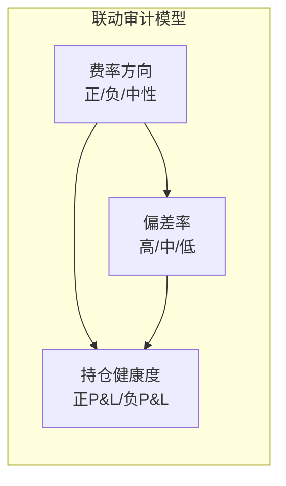

# A6 审计官 — 每日学习日志

| 项目 | 内容 |
|:-----|:------|
| 日期 | 2026-05-19 周二 |
| 时间 | 08:00 BJT |
| 主题 | **资金费率套利策略（A6未来扩展方向）** |
| 来源 | 资金费率套利原理（Perpetual Futures Funding Rate Arbitrage）— 经典delta-neutral策略 + 系统内部数据交叉验证 |
| 系统参考 | Experience #006（资金费率方向：负费率=扣分，正费率=加分）、A1 data_raw 费率采集方法（OKX API） |

---

## 学到的3个要点

### 要点1：资金费率套利的核心机制 — delta-neutral 套利

**基本原理：**

资金费率（Funding Rate）是永续合约市场中多头和空头之间定期交换的费用。当费率为正时，多头付空头；为负时，空头付多头。套利策略的核心是 **delta-neutral（中性对冲）**：

| 费率方向 | 费率含义 | 套利方向 | 具体操作 |
|:--------:|:---------|:---------|:---------|
| **正费率** (+0.01%~+0.1%) | 多头情绪过热 → 多头付钱给空头 | 做空合约 + 做多现货 | 卖出永续合约，同时买入等量现货 |
| **负费率** (-0.01%~-0.1%) | 空头情绪过热 → 空头付钱给多头 | 做多合约 + 做空现货 | 买入永续合约，同时做空等量现货 |

**关键逻辑：**
1. 持仓不暴露方向性风险（delta=0），只赚资金费率的收入
2. 年化收益 = 费率 × 费率结算频率 × 365天
3. 以Binance为例：每8小时结算一次，每天3次
4. 如果费率稳定在+0.01%/8h → 年化 = 0.01% × 3 × 365 ≈ **10.95%**

**与ZQ系统的共振：**

| ZQ当前 | 资金费率套利 | 差异 |
|:-------|:-----------|:-----|
| ✅ 已有费率数据（A1采集OKX费率Top10） | 需要实时费率监控 | 可复用现有A1数据管道 |
| ✅ 已有Experience #006（负费率扣分） | 把费率从扣分工具升级为盈利来源 | 认知升级 |
| ✅ 已有现货交易能力（A4 Blade） | 需要增加合约交易能力 | 新能力需求 |
| ❌ 无合约交易 | 现货多 + 合约空 需要合约API | 扩展交易方式 |

**对A6的审计启示：** 如果系统将来扩展资金费率套利，A6需要审计的新维度：
- 费率数据采集的时效性（延迟不要超过1个结算周期）
- 对冲比例是否精准delta-neutral（多空头寸偏差）
- 费率收益 vs 交易成本的对比（费率收入是否覆盖手续费）

---

### 要点2：资金费率套利的风险矩阵 — 不是无风险收益

资金费率套利常被宣传为"无风险套利"，但实际有多个风险点：

| 风险类型 | 描述 | 对冲方式 | 对ZQ系统的参考 |
|:---------|:------|:---------|:---------------|
| **资金费率变化风险** | 费率突然从正转负，原本赚费率变成付费率 | 多元化费率标的，动态调整 | A6需审计费率方向一致性 |
| **资金费率结算时间** | 结算时价格波动可能导致亏损 | 控制杠杆，保留缓冲 | A6需审计保证金安全性 |
| **流动性风险** | 极端行情下合约/现货限价无法成交 | 只选高流动性币种 | 可复用A2的选币标准 |
| **现货做空限制** | 很多交易所不支持现货做空 | 改用现货卖出（先借后卖）或直接用合约对冲 | ZQ当前只做多，扩展需大量基础设施 |
| **基差风险** | 永续合约价格与现货价格之间的价差波动 | 频繁再平衡 | 偏差率的另一种形式，A6可直接审计 |
| **交易所风险** | 交易所宕机/插针/清算机制 | 分散到多个交易所 | A6需定期检查交易所API状态 |

**关键洞察：** 对于当前总资只有$312.18的系统，资金费率套利的**资金门槛**是个硬约束。

| 约束项 | 要求 | ZQ当前() | 差距 |
|:-------|:----:|:---------:|:----:|
| 最小可操作仓位 | ~$100（单币种） | 总资$312 | 如果全仓做1个标的，风险集中 |
| 套利收益/天 | ~$0.03/$100(按0.01%费率×3次) | — | $300总资→每天~$0.09收益 |
| 交易成本 | 手续费0.05%~0.10%（maker+taker） | — | 变相降低年化 |
| 分散化要求 | 至少3-5个币种 | 当前持仓4币种(含USDT) | 可行但资金分散后单笔太小 |

**对A6的审计启示（亏损期预判）：** 在当前$312.18亏损27.4%的状态下，**不建议立即接入资金费率套利**。优先级应该是：
1. 🔴 先修复AWS引擎和A3牛币官（P0问题）
2. 🟡 等总资回到$400+再考虑扩展
3. 🟢 A6提前做好审计框架准备（定义审计指标、数据源检查清单）

---

### 要点3：资金费率作为系统健康信号的审计价值 — 超越套利本身

即使不直接做资金费率套利，**资金费率数据本身对审计有独立价值**：

**审计指标1：市场情绪偏度检测**

| 费率状态 | 市场含义 | A6应标记的审计风险 |
|:---------|:---------|:-------------------|
| 全市场极端正费率(>0.05%) | 极度看多 → 过热风险 | 🔴 追高买入风险预警 |
| 全市场极端负费率(<-0.05%) | 极度看空 → 恐慌 | 🟡 可能超跌反弹机会，但当前系统只做多 |
| 费率分化（部分正/部分负） | 结构市 | 🟢 正常 |
| 某币种费率突变 | 潜在事件驱动 | 🟡 建议ZH关注 |

**审计指标2：A4执行价偏差的费率影响因子**

ZQ系统Experience #006已确认：负费率币=扣分，正费率币=加分。A6可以建立：
```
费率调节偏差率 = 原始偏差率 × （1 + 费率偏差系数）
```
即: 如果A3推荐了正费率币但A4执行负偏差（买贵了），实际风险比买贵了正费率币更大。

**审计指标3：作为A3推荐质量的前置审计**

A3（牛币官）的推荐应该优先选择正费率币。A6可以新增一个审计维度：
```
A3费率一致性 = A3推荐的币中，正费率币占比 %
```
如果推荐了大量负费率币 → 要么A3策略有问题，要么市场全面看空。

**审计指标4：USDT闲置率与费率机会成本**

当前USDT闲置率71.5%（🔴），闲置USDT不产生任何收益。如果系统有费率套利能力，闲置USDT至少可以产生年化~10%的费率收益。A6可以计算：
```
费率机会成本 = USDT闲置额 × 当前市场平均费率 × 365天
```
用数字说服ZH闲置资金的真实成本。

**对A6的实操意义：**
1. 不需要等待系统接入合约交易 — A6现在就可以把费率数据作为**审计输入**引入
2. 费率数据源（A1的OKX API）已经存在，可以直接复用
3. 新增1-2个费率相关的审计指标即可提升审计报告的信息密度

---

## 怎么让A6的审计质量更高？

### 1. 把资金费率引入日常审计指标体系（立即可行、零开发成本）

当前A6每周审计3项，全是"事后检查"。费率数据可以启动**前置预警式审计**：

| 新增审计指标 | 数据源 | 触发条件 | 输出 | 开发成本 |
|:------------|:-------|:---------|:-----|:---------|
| 市场费率偏度 | A1的OKX API（已有） | 全市场平均费率>0.03%或<-0.03% | 在审计报告增加"市场情绪"行 | ✅ 无需开发 |
| A3费率一致性 | A3output + A1费率数据 | A3推荐负费率币占比>50% | 标记"""建议复查""" | 需要关联A3和A1 |
| USDT资金机会成本 | TRADES.md USDT余额 + 当前费率 | 闲置率>60% | 计算每日损失的费率收益 | 每周一计算即可 |

**落地路径：** 最简单的第一步：在下一期审计报告的头部新增一行：

```
## 市场情绪快照（新增）
| 全市场平均费率 | 偏度 | 主要正费率币 | 主要负费率币 |
|:--------------:|:----:|:----------:|:----------:|
| +0.0052% | ✅ 中性 | BTC+0.01%, ETH+0.01% | — |
```

### 2. 将审计范围从"偏差率计算"扩展到"执行质量评估"

当前A6只审计A3推荐价 vs A4执行价的偏差百分比。参考资金费率套利的delta-neutral逻辑，可以增加：

**执行质量的三维审计框架：**

| 维度 | 含义 | A6当前 | 待扩展 |
|:-----|:------|:-------|:-------|
| **价格偏差** | 买贵了还是买便宜了 | ✅ 已做 | — |
| **时机偏差** | 买入时机是否吻合趋势信号 | ❌ 未检 | 对比A3推荐时间 vs A4实际执行时间的市场变化 |
| **费率方向一致性** | 买入币种的费率方向是否支持买入 | ❌ 未检 | 检查A4买入时该币种的费率状态 |

**当A3有推荐但A4连续SKIP的场景（当前亏损期常见）需要特别审计：**
- 是否因为费率方向不支持？（市场环境问题）
- 是否因为USDT不足？（资金管理问题）
- 是否因为风控阈值阻塞？（参数配置问题）→ 这就是**A3→A4价格阻塞**审计项

### 3. 建立"费率-偏差率-持仓健康度"三角联动审计

借鉴财务审计的**比率分析法**：孤立看一个指标没有意义，联动看才能发现系统性偏差。



**三角关系解读：**

| 费率-偏差-持仓三角 | 诊断 | 审计判断 |
|:-------------------|:-----|:---------|
| 正费率 + 低偏差 + 正P&L | ✅ 健康 | 🟢 正常，A3&A4协同良好 |
| 正费率 + 高偏差 + 负P&L | ⚠️ 执行问题 | 🟡 A4买贵了，即使费率方向正确也亏损 |
| 负费率 + 低偏差 + 负P&L | ⚠️ 方向问题 | 🟡 A3选币方向错了，费率预警信号生效 |
| 负费率 + 高偏差 + 负P&L | 🔴 双击问题 | 🔴 方向+执行都差，最高优先级的审计干预 |

**对A6的实操价值：** 只需将A4的每笔交易标记费率方向（正/负/中性）和P&L（+/0/-），就能自动建立三角关联图。不需要任何额外数据采集。

### 4. 建立"扩展审计能力"的渐进路线图

| 阶段 | 时间线 | 内容 | 审计增量 |
|:----|:------:|:-----|:---------|
| **Phase 0** | 当前 | 每周三项审计 + 亏损期每日快检 | 基础审计能力 |
| **Phase 1** | 本周可做 | 将费率方向纳入审计报告（新增1行） | 多一个审计维度，数据源已有 |
| **Phase 2** | 两周内 | A3费率一致性 + 偏差分类（L2） | 从数字到分类 |
| **Phase 3** | 一月内 | 三角联动审计 + 费率偏度预警 | 系统性洞察 |
| **Phase 4** | 系统恢复后 | 资金费率套利审计框架（A4扩展合约交易时） | 审计新业务线 |

**当前最紧急（Phase 1）：** 在下次审计报告增加"市场情绪快照"行。直接读A1的data_raw.md或OKX API获取Top10费率数据，30秒就能完成的手动补充。门槛极低、信息增量大。

### 5. 审计自检：A6的"费率盲区"

复习三线模型时学到：审计者本身也需要接受审计。资金费率套利主题暴露了A6的一个盲区：

| A6盲区 | 说明 | 改进 |
|:-------|:-----|:-----|
| ❌ 不关注A1的数据管道健康度 | 费率数据依赖A1，但A6从没审计过A1的数据是否准时 | 新增"A1数据源时效性"检查项 |
| ❌ 不关注费率的系统级影响 | 只盯3项审计指标，没有理解费率和偏差率之间的关联 | 三角联动审计 |
| ❌ 不预判未来审计需求 | 只有亏损了才扩展审计项（5/17复盘补充） | 每月学习扩展一个审计维度 |

---

## 学习总结

> 资金费率套利策略的核心机制是delta-neutral对冲（做多现货+做空合约锁住费率收益），但这对ZQ当前$312.18亏损27.4%的系统来说不是立即可行的方向——资金门槛和基础设施都不够。
> 
> **对A6更有价值的洞察是：** 资金费率数据本身是高质量的审计输入。即使不接入合约交易，A6也可以立即用费率数据丰富审计报告：市场费率偏度作为前置预警、费率方向一致性作为A3推荐质量的交叉验证、费率作为偏差率的调节因子。三条落地路径（Phase 1~3）渐进执行，零开发成本从"加一行费率快照"开始。
> 
> 最大的收获是发现了A6自身的盲区——审计者从不过问数据管道的健康度。A1的OKX API是费率数据的唯一来源，但A6从未检查过A1的数据是否准时采集。这是审计体系本身的漏洞，比新增审计项更重要。

**遗留问题（下次学习再深入）：**
- 如果系统接入资金费率套利，A6需要哪些新的审计指标？
- 在USDT闲置率71.5%的当下，每日机会成本是多少？
- 费率套利的实际年化收益在ZQ的市场环境下能到多少？
